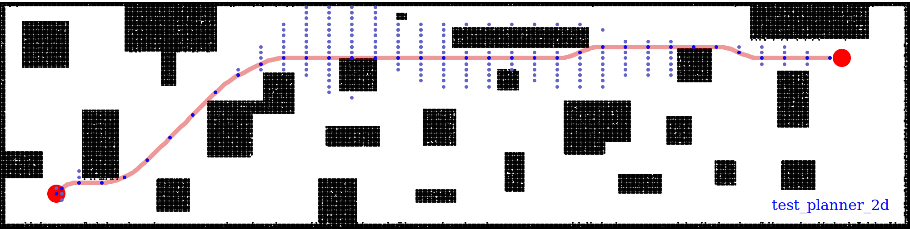
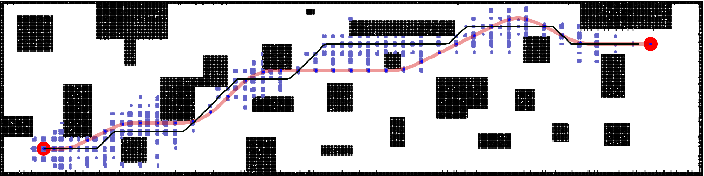
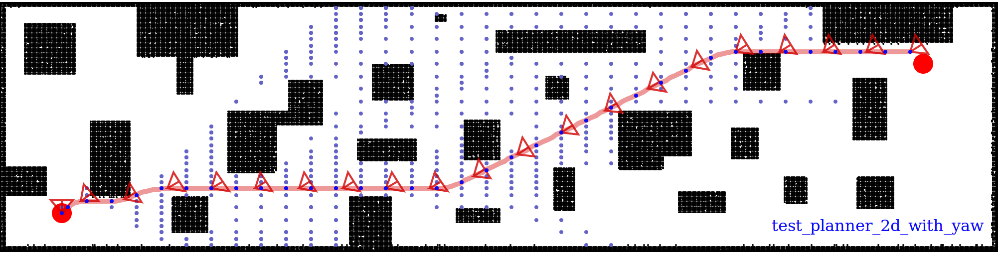

# MRSL Motion Primitive Library for quadrotor v1.0

[](https://app.wercker.com/project/byKey/ae575e9b5218e1f02684065445c6de66)
- - -
Motion Primitive Library is a search-based planner to compute dynamically feasible trajectories for a quadrotor flying in an obstacle-cluttered environment.
Our approach searches for smooth, minimum-time trajectories by exploring the map using a set of short-duration motion primitives.
The primitives are generated by solving an optimal control problem and induce a finite lattice discretization on the state space which can be explored using a graph-search algorithm.
The proposed approach is able to generate resolution-complete (i.e., optimal in the discretized space), safe, dynamically feasibility trajectories efficiently by exploiting the explicit solution of a Linear Quadratic Minimum Time problem.
It does not assume a hovering initial condition and, hence, is suitable for fast online re-planning while the robot is moving.

For technical details, refer to the original paper ["Search-based Motion Planning for Quadrotors using Linear Quadratic Minimum Time Control"](http://ieeexplore.ieee.org/document/8206119/) that has been published in IROS 2017.

## New Features in v1.0
  - Reformat the repo structure
  - Add yaw primitive
  - Add potential function to perturb trajectory

## Installation
#### Prerequisite:
  - `PCL`: apt install libpcl-dev
  - `Eigen`: apt install libeigen3-dev
  - `YAML-CPP`: apt install libyaml-cpp-dev

or simply run following commands:
```bash
$ sudo apt-get update
$ sudo apt install -y libeigen3-dev libpcl-dev libyaml-cpp-dev libproj-dev cmake
```

#### A) Simple cmake
```bash
mkdir build && cd build && cmake .. && make -j4
```

#### B) Using Catkin (not recognizable by catkin\_make)
```bash
$ mv motion_primitive_library ~/catkin_ws/src
$ cd ~/catkin_ws & catkin_make_isolated -DCMAKE_BUILD_TYPE=Release
```

#### CTest
Run following command in the `build` folder for testing the executables:
```bash
$ make test
```

If everything works, you should see the results as:
```bash
Running tests...
Test project /home/sikang/thesis_ws/src/packages/mpl_ros/motion_primitive_library/build
    Start 1: test_traj_solver
1/3 Test #1: test_traj_solver .................   Passed    0.00 sec
    Start 2: test_planner_2d
2/3 Test #2: test_planner_2d ..................   Passed    0.84 sec
    Start 3: test_planner_2d_prior_traj
3/3 Test #3: test_planner_2d_prior_traj .......   Passed    0.89 sec

100% tests passed, 0 tests failed out of 3

Total Test time (real) =   1.73 sec
```

#### Include in other projects:
To link this lib properly, add following in the `CMakeLists.txt`
```
find_package(motion_primitive_library REQUIRED)
include_directories(${MOTION_PRIMITIVE_LIBRARY_INCLUDE_DIRS})
...
add_executable(test_xxx src/test_xxx.cpp)
target_link_libraries(test_xxx ${MOTION_PRIMITIVE_LIBRARY_LIBRARIES})

```


## Example Usage
### Preparation
To run the planner, three components are required to be set properly:

#### 1) Set Start and Goal:
We use the`class Waypoint` for the start and goal. A `Waypoint` contains coordinates of position, velocity, etc and the flag `use_xxx` to indicate the control input.
An example for 2D planning is given as:
```c++
Waypoint2D start, goal; // Initialize start and goal as Waypoint2D
start.pos = Vec3f(2.5, -3.5);
start.use_pos = true;
start.use_vel = true;
start.use_acc = false;
start.use_jrk = false;
start.use_yaw = false;
goal.pos = Vec3f(35, 2.5);
goal.control = start.control;
```

The flag `use_xxx` indicates the planner to plan in different control space. For example, the above example code sets the control in `ACC` space. Eight options are provided by setting following flags:

~   | VEL | ACC | JRK | SNP | VEL&YAW | ACC&YAW | JRK&YAW | SNP&YAW
:-- | :-- | :-- | :-- | :-- | :------ | :------ | :------ | :------
`use_pos:` | `true` | `true` | `true` | `true`  | `true`  | `true` | `true` | `true`
`use_vel:` | `false` | `true` | `true` | `true` | `false` | `true` | `true` | `true`
`use_acc:` | `false` | `false` | `true` | `true` | `false` | `false` | `true` | `true`
`use_jrk:` | `false` | `false` | `false` | `true` | `false` | `false` | `false` | `true`
`use_yaw:` | `false` | `false` | `false` | `false` | `true` | `true` | `true` | `true`


In equal, one can also set the attribute `control` of `Waypoint` for the same purpose:

~  | VEL | ACC | JRK | SNP | VEL&YAW | ACC&YAW | JRK&YAW | SNP&YAW
:--| :-- | :-- | :-- | :-- | :------ | :------ | :------ | :------
`control:` | `Control::VEL` | `Control::ACC` | `Control::JRK` | `Control::SNP` | `Control::VELxYAW` | `Control::ACCxYAW` | `Control::JRKxYAW` | `Control::SNPxYAW`

#### 2) Set collision checking method:
Any planner needs a collision checking function, there are several utils in this package to checking collision for obstacles in different representations.
In the most common environment where obstacles are represented as voxels, we use `class MapUtil` which is a template class that adapts to 2D (`OccMapUtil`) and 3D (`VoxelMapUtil`).
An example for initializing a 2D collision checking `OccMapUtil` is given as:
```c++
std::shared_ptr<MPL::OccMapUtil> map_util; // Declare as a shared pointer
map_util.reset(new MPL::OccMapUtil); // Initialize map_util
map_util->setMap(origin, dim, data, resolution); // Set the map information
...
planner->setMapUtil(map_util); // Set collision checking util
```

Here `origin`, `dim`, `data` and `resolution` are user input.

#### 3) Set control input:
Our planner takes control input to generate primitives. User need to specify it before start planning.
An example for the control input `U` for 2D planning is given as following, in this case, `U` simply include 9 elements:
```c++
decimal_t u_max = 0.5;
vec_E<VecDf> U;
const decimal_t du = u_max / num;
for(decimal_t dx = -u_max; dx <= u_max; dx += du )
  for(decimal_t dy = -u_max; dy <= u_max; dy += du )
      U.push_back(Vec2f(dx, dy));
...
planner->setU(U); // Set control input
```

### Run the planner:
After setting up above 3 required components, a plan thread can be launched as:
```c++
std::unique_ptr<MPL::OccMapPlanner> planner(new MPL::OccMapPlanner(true)); // Declare a 2D planner with verbose
planner->setMapUtil(map_util); // Set collision checking util
planner->setU(U); // Set control input
planner->setDt(1.0); // Set dt for each primitive

bool valid = planner->plan(start, goal); // Plan from start to goal
```

## Test Examples
#### Example1 (direct planning):
After compiling by `cmake`, run following command for test a 2D planning in a given map:
```bash
$ ./build/devel/lib/test_planner_2d ../data/corridor.yaml
```

You should see following messages if it works properly:
```
[MapPlanner] PLANNER VERBOSE ON
[PlannerBase] set v_max: 1.000000
[PlannerBase] set a_max: 1.000000
[PlannerBase] set dt: 1.000000
Start:
pos:  2.5 -3.5
vel: 0 0
acc: 0 0
jrk: 0 0
yaw: 0
use_pos | use_vel | use_acc | use_jrk | use_yaw :
1 | 1 | 0 | 0 | 0
control: 11000
use acc!
Goal:
pos:  37 2.5
vel: 0 0
acc: 0 0
jrk: 0 0
yaw: 0
use_pos | use_vel | use_acc | use_jrk | use_yaw :
1 | 1 | 0 | 0 | 0
control: 11000
use acc!

++++++++++++++++++ PLANNER +++++++++++++++
+                  w: 10.00               +
+                 dt: 1.00               +
+                 ds: 0.0100               +
+                 dv: 0.1000               +
+                 da: 0.1000               +
+                 dj: 0.1000               +
+              v_max: 1.00               +
+              a_max: 1.00               +
+              j_max: -1.00               +
+              U num: 9                +
+            tol_dis: 0.50               +
+            tol_vel: 0.00               +
+            tol_acc: 0.00               +
+              alpha: 0                 +
+heur_ignore_dynamics: 1                 +
++++++++++ PLANNER +++++++++++

Start from new node!
goalNode fval: 358.000000, g: 353.000000!
Expand [291] nodes!
Reached Goal !!!!!!
...
MPL Planner takes: 5.000000 ms
MPL Planner expanded states: 260
Total time T: 35.000000
Total J:  J(VEL) = 38.750000, J(ACC) = 3.000000, J(JRK) = 0.000000, J(SNP) = 0.000000
```

The output image `output.svg` is saved in the current folder:

(blue dots show the expended states, red circles indicate start and goal).

It is recommended to visualize the `svg` in web browser (for example, `firefox output.svg`).

#### Example2 (planning with a prior trajectory):
Run following command for test a 2D planning, it first finds a trajector in low dimensional space (acceleration-driven), then it uses the planned trajectory to refine for a trajectory in high dimensional space (jerk-driven):
```bash
$ ./build/devel/lib/test_planner_2d_prior_traj ../data/corridor.yaml
```

In the following output image, the black curve is the prior trajectory:


#### Example3 (trajectory generation):
Generate trajectory from a given path, without obstacles:
```bash
$ ./build/devel/lib/test_traj_solver
```


Here we generate three different trajectories using the same path and time allocation: the red one is minimum velocity trajectory, the green one is the minimum acceleration trajectory and the blue one is the minimum jerk trajectory.

## Doxygen
For API, please refer to [Doxygen](https://sikang.github.io/motion_primitive_library).

## ROS Wrapper
The interface with ROS for visualization and implementation can be found in [`mpl_ros`](https://github.com/sikang/mpl_ros.git).
